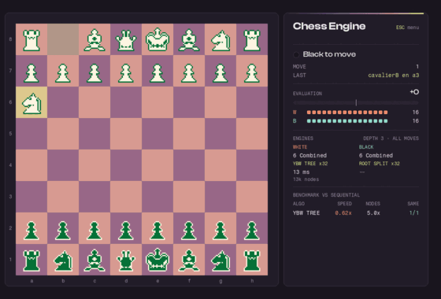
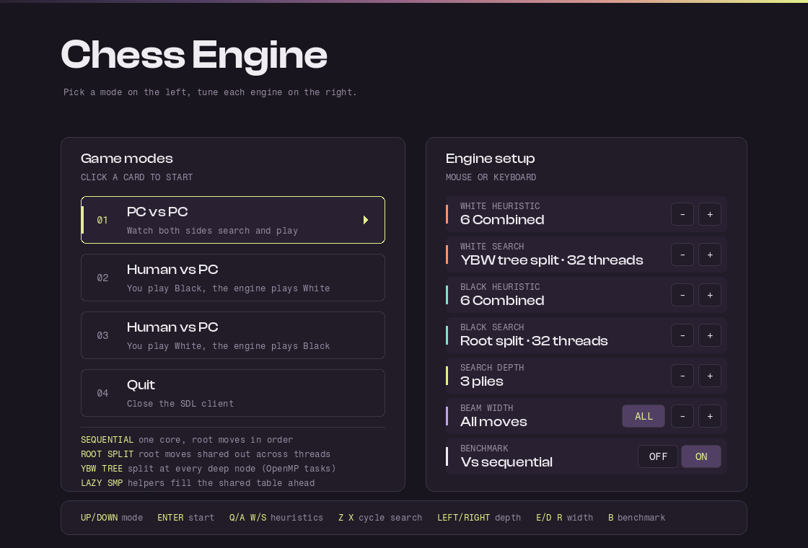

# Chess Engine

A C chess engine with alpha-beta pruning, four interchangeable search algorithms (one sequential,
three parallel with OpenMP), a console interface and an SDL2 frontend.





## Features

- alpha-beta search with a transposition table and Zobrist hashing
- four root searches, selectable per side, that all return the same move and score
- built-in benchmark comparing any parallel search against the sequential one
- seven evaluation functions
- console and SDL frontends, with human play, captures and promotion

## Layout

| Path | What it is |
| --- | --- |
| `jeu.c` / `jeu.h` | engine: move generation, evaluation, search |
| `main.c` | console program |
| `main_sdl.c` / `ui.c` / `ui.h` | SDL main loop and rendering |
| `chess_green/`, `fonts/` | piece sprites and fonts |
| `build_windows.ps1`, `build_linux.sh`, `Makefile` | build helpers |

## Build

### Windows

With any MinGW-w64 `gcc` on `PATH`:

```powershell
powershell -ExecutionPolicy Bypass -File build_windows.ps1            # SDL build
powershell -ExecutionPolicy Bypass -File build_windows.ps1 -Console   # also chess_console.exe
```

On the first run it downloads the SDL2 MinGW packages into `deps/` and the Clash Display font into
`fonts/`, then copies the runtime DLLs next to the exe.

### Linux

```bash
sudo apt-get install build-essential libsdl2-dev libsdl2-image-dev libsdl2-ttf-dev
./build_linux.sh
```

### Makefile

`make console`, `make sdl`, `make all`, `make clean`. Run the binaries from the project directory
so they find `chess_green/` and `fonts/`.

## Search algorithms

Each side picks one of four root searches (`chercher_meilleur_coup` in `jeu.c`):

| Algorithm | How it splits the work |
| --- | --- |
| Sequential | one core, root moves in order |
| Root split | first move alone for a bound, the rest shared across threads |
| YBW tree split | the same idea at every node 4+ plies from the horizon, via OpenMP tasks |
| Lazy SMP | helpers search ahead and fill the shared table for a sequential main thread |

All four return the same move and score as the sequential search. The table only reuses a score
stored at exactly the same depth, and never stores nodes extended by a capture, whose value
depends on how they were reached. Searching happens on a worker thread, so the window stays
responsive.

Measured on an i9-14900HX (8 performance + 16 efficiency cores, 32 threads), depth 6, heuristic 6:

| Algorithm | Time | Speedup | Nodes vs sequential |
| --- | --- | --- | --- |
| Sequential | 27.0 s | 1.00x | 1.0x |
| Root split | 11.7 s | 2.30x | 2.0x |
| YBW tree split | 12.0 s | 2.25x | 5.7x |
| Lazy SMP | 44.8 s | 0.60x | 20.4x |

Speedup stays near 2x because parallel threads start sibling moves before a tight bound exists and
so search more nodes, and because 16 of the 32 threads run on slower efficiency cores.

## Benchmark mode

With **Benchmark** on, every engine move is also searched by the sequential baseline. The side
panel shows, per algorithm, the speedup, the node ratio and how often both chose the same move.
Every compared position is appended to `benchmark.csv`.

A scripted benchmark game, which needs no interaction:

```bash
chess_sdl --pcvpc --benchmark --depth 4 --white ybw --black par --quit-after 60
```

Flags: `--depth N`, `--width N`, `--heuristic N` (1-7), `--white`/`--black` with `seq|par|ybw|lazy`,
`--quit-after N`.

## Controls

**Menu.** `Up`/`Down` mode, `Enter` start, `Q`/`A` and `W`/`S` heuristics, `Z`/`X` cycle search,
`Left`/`Right` depth, `E`/`D` width, `R` all moves, `B` benchmark. The cards and buttons are
clickable.

**Game.** Left click selects and moves, right click cancels, `Esc` returns to the menu.

**Console.** Moves are typed as `d2d4` or `d 2 d 4`.

## Credits

Original MinMax / alpha-beta teaching base: Hidouci W.K. / ESI 2025. Later work in this repository
includes the SDL frontend, the parallel searches, refactors and fixes.

Chess pieces by Ajay Karat (Devil's Work.shop, http://devilswork.shop).

Fonts: Fragment Mono by Wei Huang, bundled under the SIL Open Font License
(`fonts/OFL-FragmentMono.txt`). Clash Display by Indian Type Foundry is used under the ITF Free
Font License and is not redistributed here; `build_windows.ps1` downloads it, and the UI falls
back to a system font without it.

## License

CC0 1.0 Universal, except the bundled fonts, which keep their own licenses.
